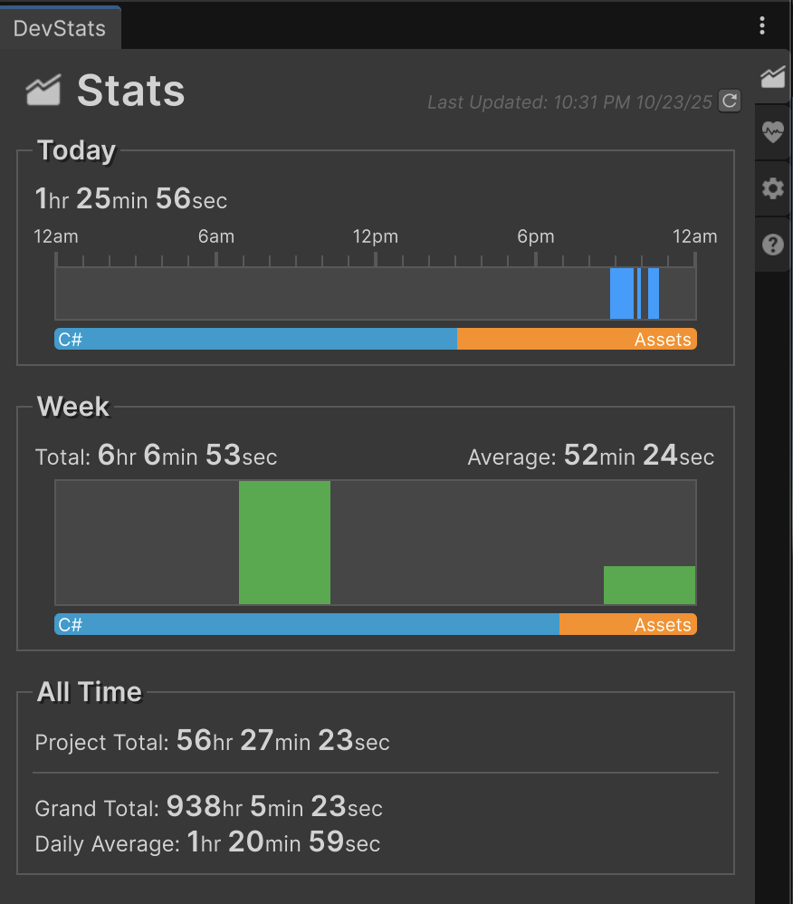
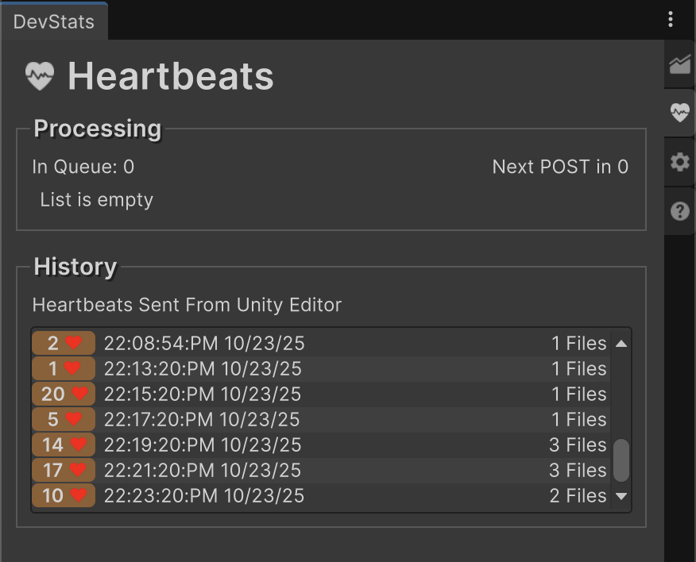
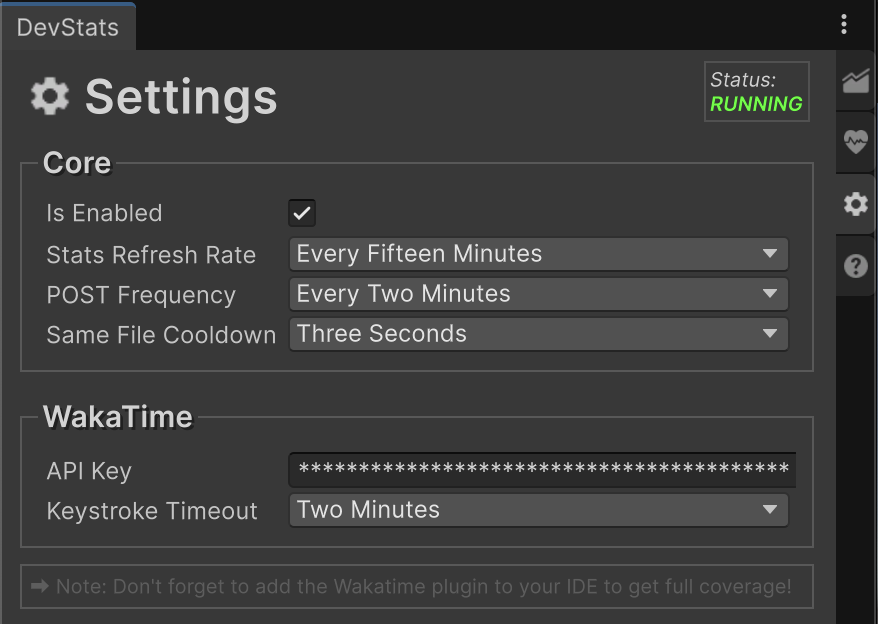
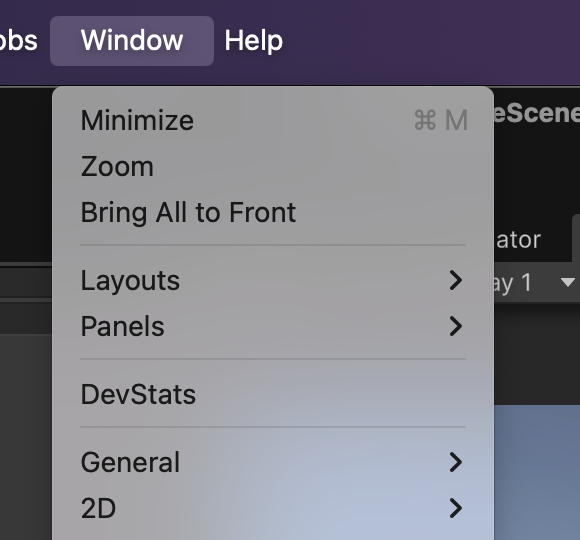

# DevStats

Time Tracking for Unity powered by WakaTime.

DevStats is your personal time tracker built into the Unity editor. It automatically tracks how much time you spend editing scenes, prefabs, UI documents, and more.

Combine it with another WakaTime plugin for your IDE to achieve complete, project-wide tracking and better understand how you spend your development time.

Supports both Windows and Mac.

# Features

## Stats Panel
Visualize basic stats from the Stats panel. Stats are automatically updated at an interval adjustable in the settings. You can also force update the stats through a button.

More detailed stats can be seen at Wakatime.com

## Heartbeats Panel
From the <b>Heartbeats Panel</b> you can see your queued heartbeats that have yet to be sent, a history of the most recent heartbeats, and a list of failed-to-send heartbeats that can be reattempted through an easy click of a button.

Heartbeats are collected and sent to the Wakatime CLI once every 2 minutes.

## Settings Panel

Settings are very straightforward.

DevStats does not run unless both `IsEnabled = true` and the WakaTime API Key is valid.

# Setup

